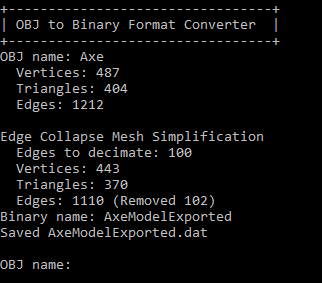
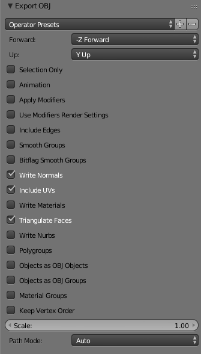

# 3D Model File Format

**How to use:**

Run the executable provided in the [Releases](https://github.com/Matrix4f/3D-Model-File-Format/releases) page.
  1. Enter the filepath of the model (excluding the .obj extension)
  2. Enter how aggressive you want the inbuilt edge collapse mesh simplification to be. (0 means no mesh simplification, any other numbers signal the number of edges you wish to remove)
  3. Enter the output path of the file, where the model will be exported to (excluding the .dat extension, which is automatically appended to the end of the filepath)

Example:



**Inspiration**

When working with OpenGL and C++ to render 3D models onto a window, I realized that common file formats such as the Wavefront OBJ format and the COLLADA format, lack one thing: speed.

Though OBJ files are rather basic, parsing large files takes a while, because of some of the inherent design choices of the creators of the format, such as using a text-based format. However, the Wavefront OBJ format does have its merits: being widely supported, easily read and written, as well as being robust.

If only there were a way to minimize model loading speed, all the while being able to use this OBJ format!

**How does this work?**

The 3d model format utility first loads an OBJ exported with these settings:



Then, it requests the user whether they desire to simplify mesh vertices using an edge-collapse algorithm. This mesh simplification seeks to reduce vertex count, improve rendering times, and lower file size.

Lastly, the file is saved in a binary file with the ".dat" extension (dat is an abberviation of the word data).

**Dependencies:**

This utility uses my [Binary-IO API](https://github.com/Matrix4f/Binary-IO) in a folder named BinIO, as well as the [glm](https://glm.g-truc.net/) API for vectors.

**How do I parse a model that I've converted using this utility?**

```cpp

template<typename T>
void ReadIndices(BinaryReader& reader, Mesh& mesh)
{
	mesh.indices = new unsigned int[mesh.iCount];
	unsigned int nextIndex = 0;

	for (unsigned int i = 0; i < mesh.iCount; i++)
		mesh.indices[i] = reader.read<T>();

}

Mesh LoadBinaryMeshData(const std::string& filename)
{
	Mesh mesh;

	BinaryReader reader(filename);
	reader.ensureHeader("model", Version(1, 0, 0));
	
	mesh.vCount = reader.read<unsigned int>();

	mesh.vertices = reader.readBlock<float, unsigned int>(mesh.vCount * 3);
	mesh.textures = reader.readBlock<float, unsigned int>(mesh.vCount * 2);
	mesh.normals = reader.readBlock<float, unsigned int>(mesh.vCount * 3);
	
	if (reader.read<bool>()) //whether tangents are stored in this model
		mesh.tangents = reader.readBlock<float, unsigned int>(mesh.vCount * 3);
	else
		mesh.tangents = nullptr;

	mesh.iCount = reader.read<unsigned int>();
	unsigned char type = reader.read<unsigned char>();

	switch (type)
	{
        case 0:
            ReadIndices<unsigned char>(reader, mesh);
            break;
        case 1:
            ReadIndices<unsigned short>(reader, mesh);
            break;
        case 2:
            ReadIndices<unsigned int>(reader, mesh);
            break;
        default:
            std::cout << "Incompatible indices type: " << (unsigned int) type << std::endl;
	}

	reader.close();
	
	return mesh;
}
```
Invoke the method LoadBinaryMeshData with the desired filename. The resulting Mesh will contain the vertices, UV texture coordinates, normal vectors, and tangent vectors, of the supplied binary file. They can now be placed into vertex buffers and sent to OpenGL!
